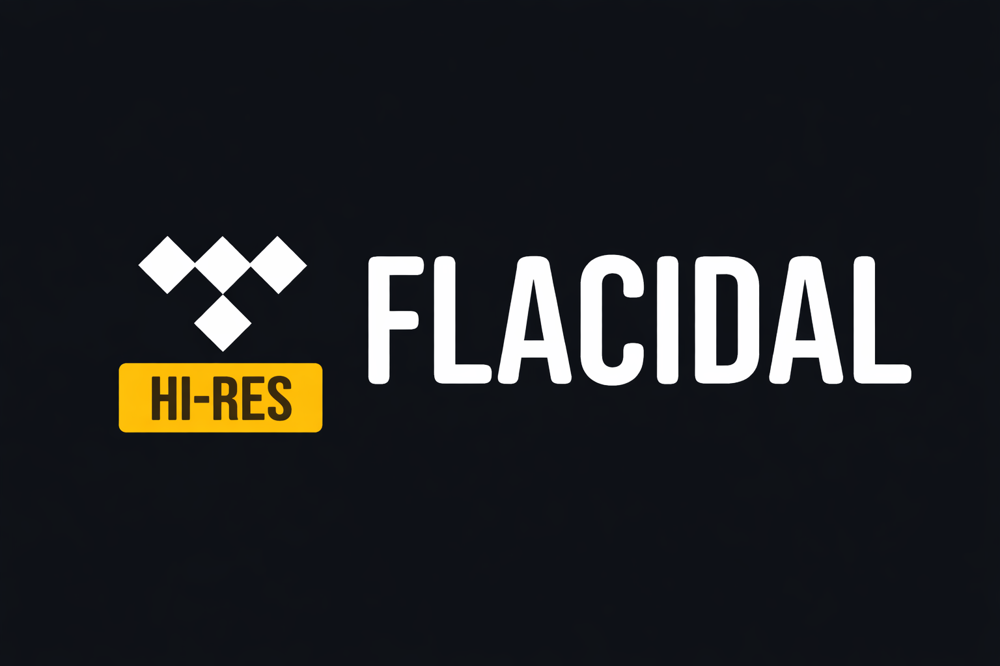
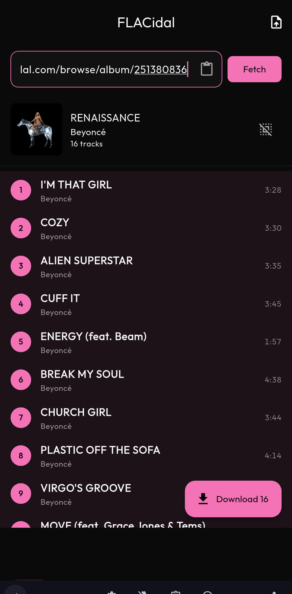
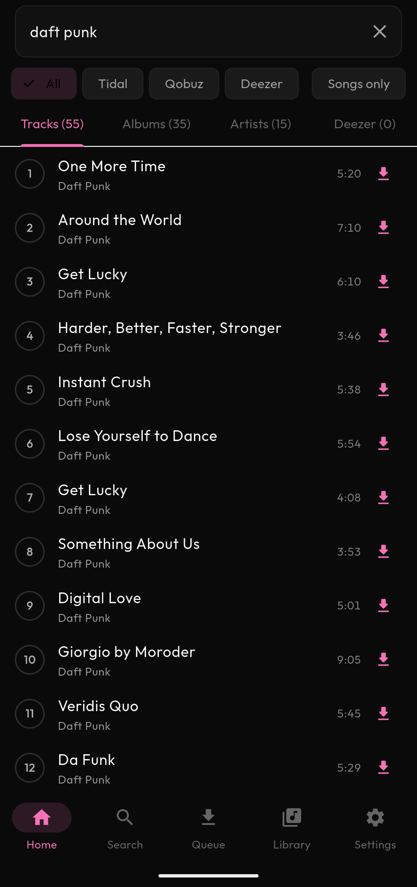
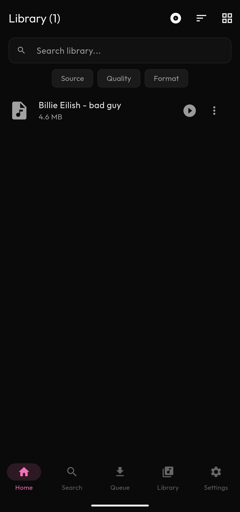
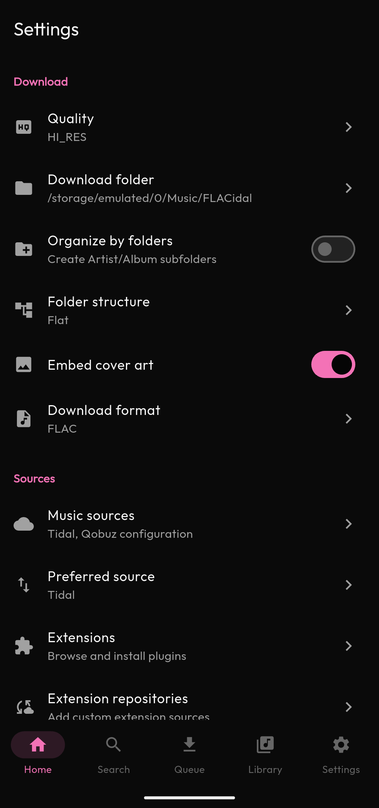
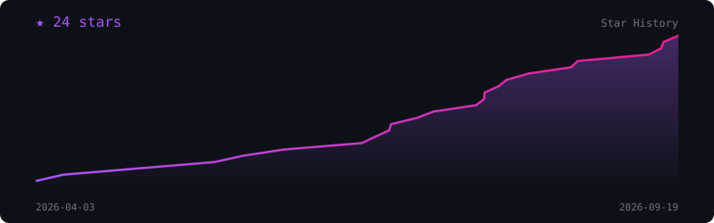

<div align="center">



### FLACidal Mobile

**Grab lossless FLAC tracks from Tidal & Qobuz straight onto your phone**

[](https://github.com/kushiemoon-dev/flacidal-mobile/releases/latest)
[](https://github.com/kushiemoon-dev/flacidal-mobile/stargazers)
[](LICENSE)
[](https://flutter.dev)
[](https://go.dev)


</div>

---

<div align="center">




</div>

---

## Overview

Think of **FLACidal Mobile** as the on-the-go counterpart to [FLACidal Desktop](https://github.com/kushiemoon-dev/FLACidal): drop in a Tidal URL, pick your tracks, and grab Hi-Res or Lossless FLAC straight onto your device — no account needed.

The UI runs on Flutter, while a shared Go backend reachable through FFI drives every part of the download pipeline.

---

## Features

- **Hi-Res & Lossless** — Up to 24-bit/192 kHz straight from Tidal and Qobuz
- **Paste & Download** — Drop in any Tidal URL — album, playlist, track, or artist
- **URL Resolution** — Links from other platforms get auto-resolved to Tidal through Odesli
- **Search** — Switch providers and sort results while browsing Tidal and Qobuz
- **Real-time Queue** — Watch download speed, ETA, and per-track percentage live
- **Background Downloads** — A foreground service keeps transfers going even after you close the app
- **Library** — Albums grouped by disc number, filterable by source/quality/format, with "Already in Library" flagging
- **Metadata Editing** — Every field — title, artist, album, composer, genre, ISRC, and more — is editable right in the app
- **Cover Art** — Pull embedded artwork out and save it as a standalone .jpg
- **Lyrics** — Grab synced or plain lyrics, embed them in the FLAC, or export as .lrc
- **Re-enrich** — Refresh and re-embed metadata without touching the audio again
- **Format Conversion** — Convert FLAC into MP3, AAC, or Opus while keeping all metadata intact
- **MP3 Tagging** — Complete ID3v2 tagging for MP3, cover art and lyrics and composer included
- **Artist Tag Modes** — Choose joined or split Vorbis ARTIST tags for multi-artist tracks
- **Singles/Albums Folders** — Singles and albums land in separate folders automatically
- **Extension System** — Add community extensions to pull in more music sources
- **Audio Analysis** — Spot upscaled files via spectrum analysis with a confidence score
- **Custom Theme** — Matches the desktop app's dark theme, with the Outfit font and accent color options
- **Share Intent** — Share a Tidal link from your browser and downloading starts right away

---

## Download

**[Download Latest APK](https://github.com/kushiemoon-dev/flacidal-mobile/releases/latest)**

| Platform | File | Install |
|----------|------|---------|
| Android | `FLACidal.apk` | Direct install |

> **iOS:** iOS is supported by the codebase, but nobody with an Apple Developer account has stepped up yet to handle code signing and IPA distribution. Want to help out? Check [Contributing](#contributing).

---

## Usage

1. Launch **FLACidal Mobile**
2. Drop in a Tidal URL (or share one straight from your browser)
3. Pick your tracks and hit **Download**
4. Files land in `Music/FLACidal/` on your device

### Supported Content

| Source | Types |
|--------|-------|
| **Tidal** | Album · Playlist · Track · Mix · Artist |
| **Qobuz** | Album · Playlist · Track |
| **Other** | Any music URL (resolved via Odesli) |

---

## Architecture

```
flacidal-mobile/         Flutter app
├── lib/
│   ├── core/            FFI bridge + URL resolver
│   ├── pages/           14 screens
│   ├── widgets/         8 reusable components
│   ├── providers/       Riverpod state management
│   ├── theme/           Custom dark theme
│   └── router/          GoRouter navigation
│
flacidal-core/           Shared Go backend (compiled as .so/.a)
```

Networking, downloads, metadata, and storage are all handled by the Go backend, while Flutter takes care of the UI — the two talk to each other via JSON-RPC over FFI.

---

## Build from Source

**Requirements:** Flutter 3.41+, Go 1.26+, Android NDK r29

```bash
# 1. Build Go shared libraries
cd flacidal-core
make android-arm64
make install-android

# 2. Build Flutter APK
cd ../flacidal-mobile
flutter build apk --release
```

### iOS (requires macOS + Xcode)

```bash
cd flacidal-core
make ios
make install-ios

cd ../flacidal-mobile
flutter build ipa --no-codesign
```

---

## Configuration

| Setting | Default | Options |
|---------|---------|---------|
| Quality | `LOSSLESS` | `HI_RES_MAX` · `HI_RES_LOSSLESS` · `LOSSLESS` · `HIGH` |
| Format | `FLAC` | `FLAC` · `M4A` · `ALAC` |
| Folder structure | Flat | By Artist/Album · By Playlist · Flat · Singles/Albums |
| Artist tag mode | Joined | `joined` (single field) · `split` (multi-value Vorbis) |
| Theme | Dark | Dark · Light · System |
| Accent color | Pink | 12 presets |
| Font | Outfit | 16 options |

---

## FAQ

**Do I need a Tidal account?**
Nope — FLACidal takes care of authentication on its own.

**Where are files saved?**
On Android, `/storage/emulated/0/Music/FLACidal/` — and it's configurable from Settings.

**Is iOS supported?**
It compiles for iOS already, though Apple signing still needs a contributor. In the meantime you can build it yourself with `flutter build ipa --no-codesign` and sideload through AltStore/SideStore. Contributions are very welcome!

**Does it work in the background?**
It does — a foreground service keeps downloads going while the app sits minimized.

---

## Contributing

Contributions are welcome — here's where extra hands would help most:

- **iOS build & signing** — Someone with an Apple Developer account is needed to set up code signing, TestFlight distribution, and the AltStore source; the Flutter + Go FFI codebase is already iOS-ready.
- **Bug reports** — File an issue that includes steps to reproduce.

---

## Star History

[](https://github.com/kushiemoon-dev/flacidal-mobile/stargazers)

---

## Disclaimer

FLACidal Mobile exists strictly for **personal and educational purposes**. It has no affiliation with, endorsement from, or connection to Tidal, Qobuz, or any other streaming service. Making sure your usage stays within local laws and each platform's Terms of Service is entirely on you. The software is provided "as is" without warranty of any kind.

---

<div align="center">

**MIT License** · [Desktop App](https://github.com/kushiemoon-dev/FLACidal) · [Releases](https://github.com/kushiemoon-dev/flacidal-mobile/releases)

Built with ♥ by [KushieMoon](https://github.com/kushiemoon-dev)

</div>
